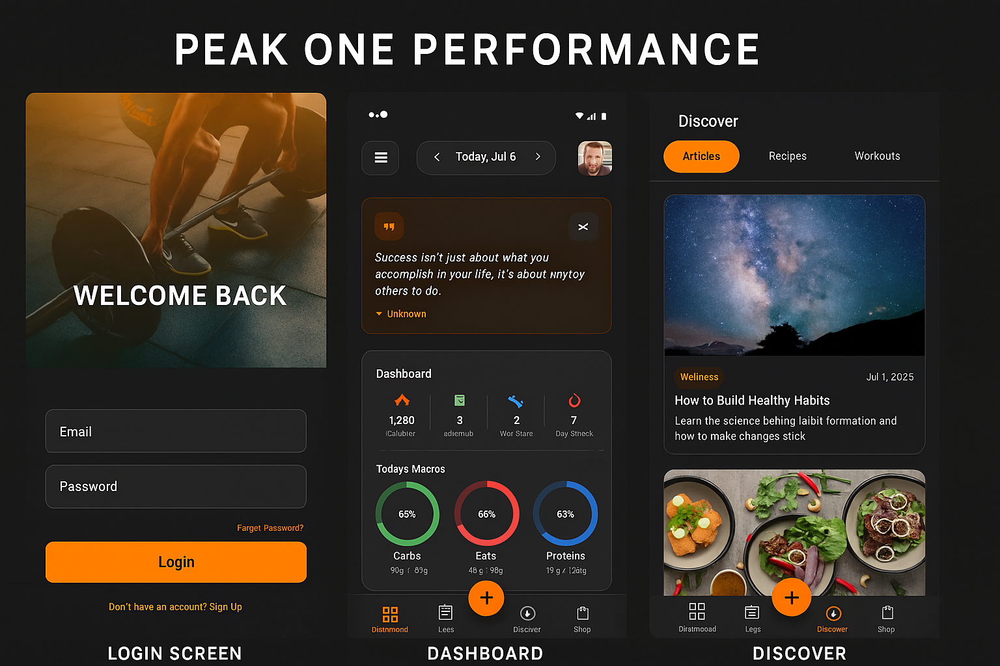

# 🏔️ Peak One Performance

Welcome to the official GitHub organization for **Peak One Performance (P1P)** — a next-generation fitness platform built to transform how trainers and clients connect, track, and achieve real results.

We’re creating a high-performance ecosystem that makes fitness personal, nutrition simple, and progress inevitable.

---

## 💡 What We’re Building

Peak One Performance is an all-in-one experience for:
- 🏋️ Workout tracking and performance metrics  
- 🍽️ Meal logging, macro tracking, and personalized goals  
- 📈 Progress analytics that actually mean something  
- 📲 Real-time trainer–client communication  
- 🛍️ In-app store for gear, supplements, and more  

Everything is designed to sync seamlessly across mobile and backend systems — built for scale and optimized for results.

---

## 📸 Preview

---

## 🔒 Private Repositories

Development is fully private while we focus on building and refining the core experience. Our architecture is modular, secure, and built to scale.

Our internal repos include:
- `PeakOnePerformance-Android` – Native Kotlin app (Jetpack Compose)  
- `PeakOnePerformance` – Microservices backend (NestJS, PostgreSQL, Redis, NATS)  
- `PeakOnePerformance-IOS` – Native Swift app  

---

## 🧠 Our Motto

**"Probably too hard for you."**  
Peak One Performance is built for those who push boundaries — athletes, trainers, and developers alike.

---

### 📫 Stay in the Loop

- 💬 [Discord](https://discord.gg/JHUYUNaYd3)
- 🤖 [Reddit](https://www.reddit.com/r/peakoneperformance/)

---
<!--
- 🌐 [Website](https://peakoneperformance.com) *(coming soon)*  
- 🧵 [Threads](https://www.threads.net/@peakoneperformance)  
- 🐦 [X / Twitter](https://twitter.com/p1p_official) 
-->
> Built by people obsessed with performance. Driven by data. Fueled by purpose.
